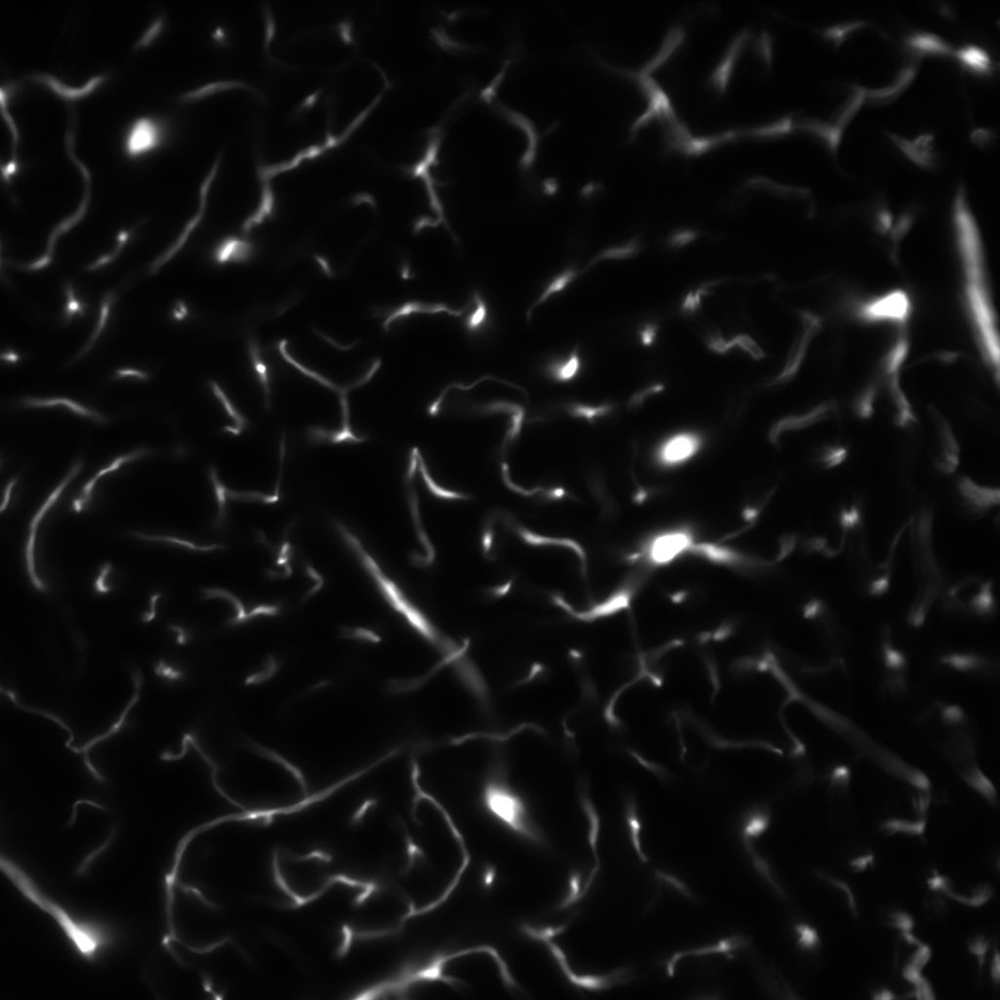
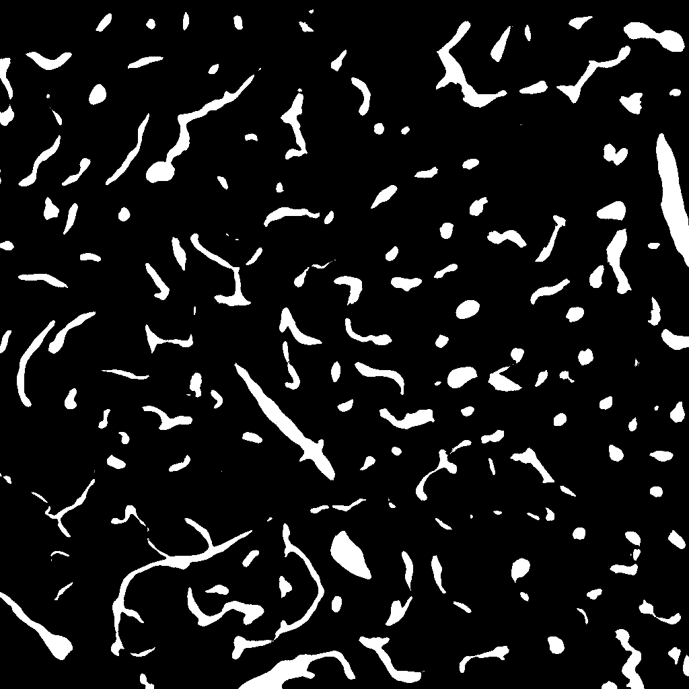
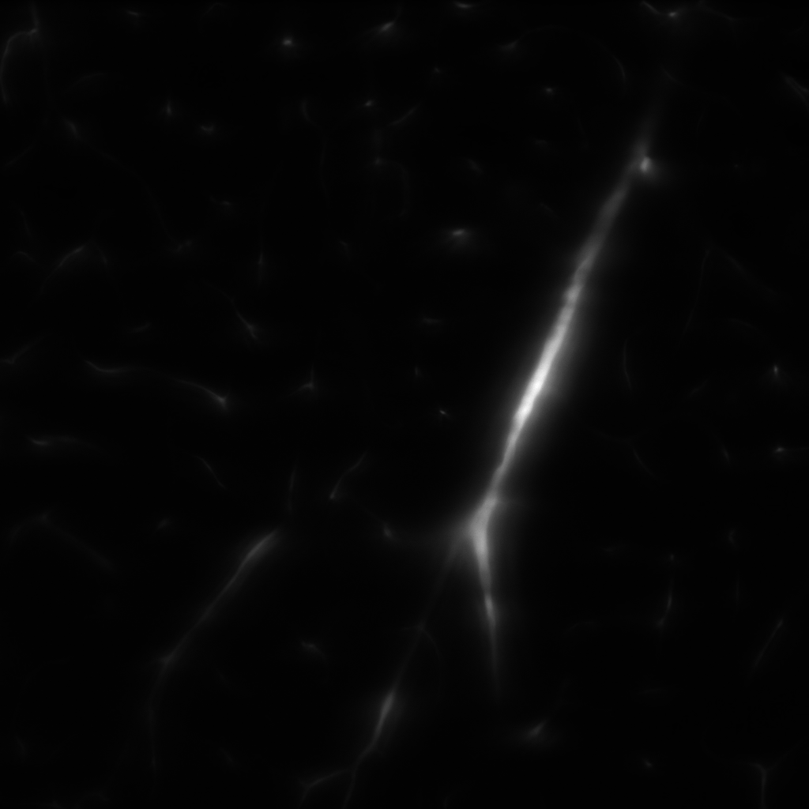
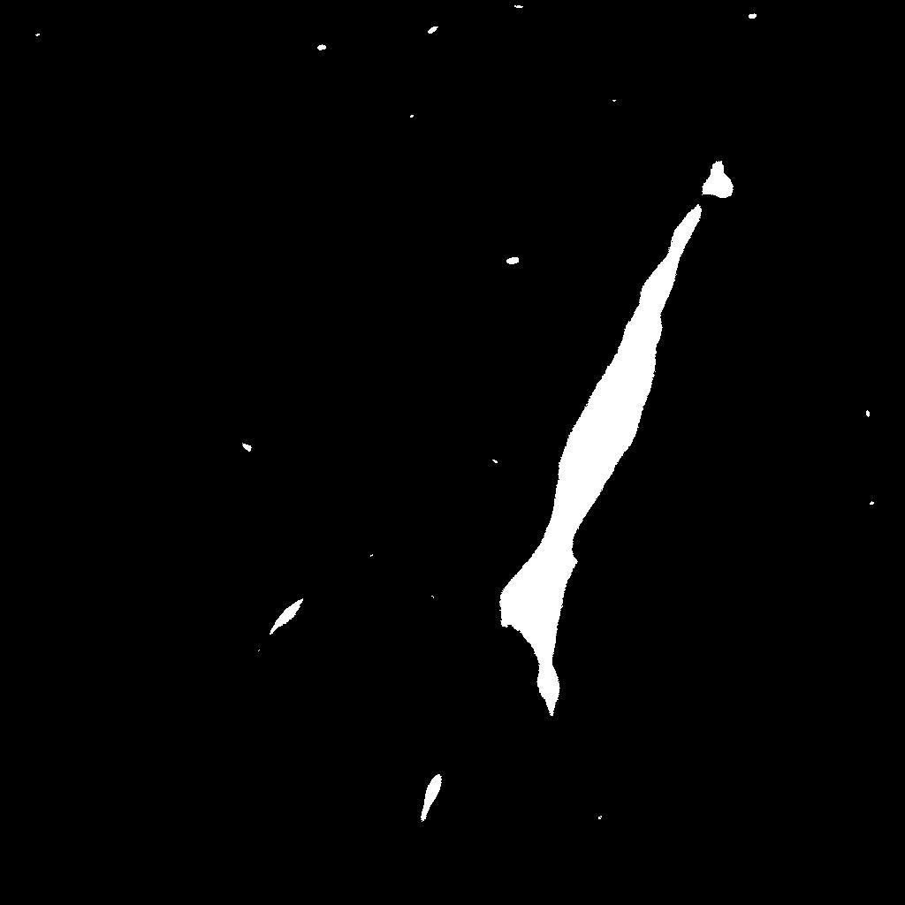
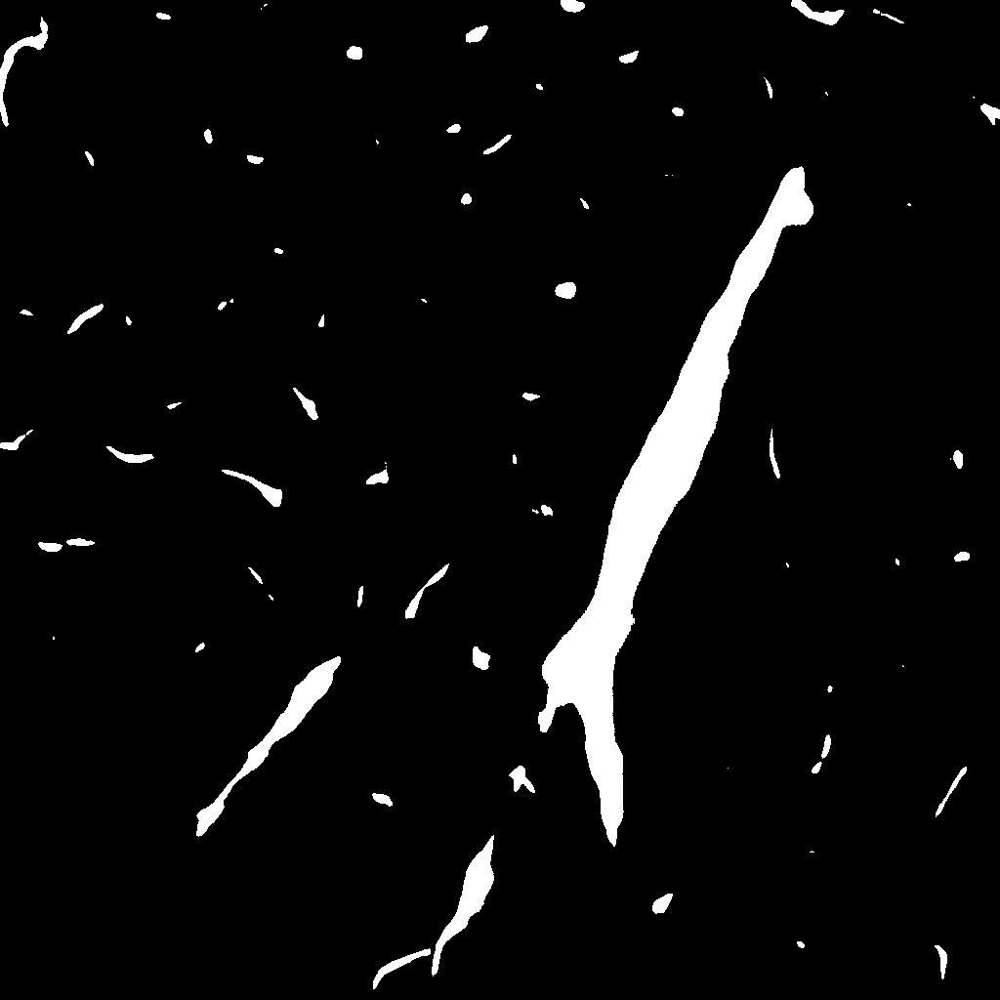

# Transfer Learning based Segmentation Workflow

## What it is and why you need it

This workflow allows you to yield segmentations for structures like cells or synapses in 2D images (or 3D image volumes). This workflow introduces an unsupervised learning approach which can work under the scenario wherein the labels are available for a source domain and one would like to transfer that knowledge to generate good results on an unlabelled target domain. An example application scenario would be when we have labelled data for one part of the brain and we want to get results on another part of brain (for which we do not have labels). Since the statistical properties of the target domain data can be differ from that of the source domain data, the typical supervised learning based DL methods does not yield good results on target data. This is why one need to use transfer learning techniques to obtain enhanced segmentation outputs.

## How it works

At the core of this workflow is a deep learning (DL) framework that is designed to perform segmentation of input images. To train the DL network, the user needs to provide training data comprising of input images and the corresponding ground truth segmentation labels. This workflow can be used to obtain segmentation results in the following scenario of transfer learning: The ground truth labels are available only for a certain kind of inputs (namely source domain), and the user wants to get segmentation results on slightly different kind of data (namely target domain). This approach requires training data of the following form: Source domain data comprising input images and corresponding ground truth labels, and target domain data comprising input images alone.

As segmentation network, this workflow uses variants of [U-Net](https://doi.org/10.1007/978-3-319-24574-4_28) as well as [two-stream U-Net](https://doi.org/10.1109/ISBI.2018.8363602). The training of the network is done offline. Once trained, the user will be provided with an inference module which can be used to obtain segmentation results on data from target domain.

## Example application

To demonstrate the effectiveness of this approach, example results for the task of brain vasculature segmentation is shown next. The target images used in this experiment was captured under a different condition as compared to the source data (data from Ludovico Silvestri's European Laboratory for Non-linear Spectroscopy (LENS)). Sample images from the dataset is shown below.

Source domain image

Source domain label

Target domain image

As is evident, the target images were captured under a different conditions as compared to source domain and are therefore affected by blur and other kinds of distortions. The segmentation outputs obtained from networks trained with and without transfer learning is shown below.

Segmentation Output on Target Image with no Transfer Learning

Segmentation Output on Target Image with Transfer Learning

References:

Ronneberger, Olaf et al. U-net: Convolutional networks for biomedical image segmentation. MICCAI 2015.

Bermudez, Roger et al. A domain-adaptive two-stream U-Net for electron microscopy image segmentation. ISBI 2018.
